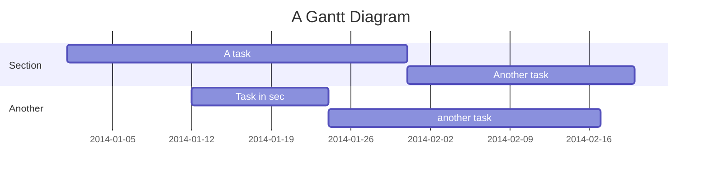
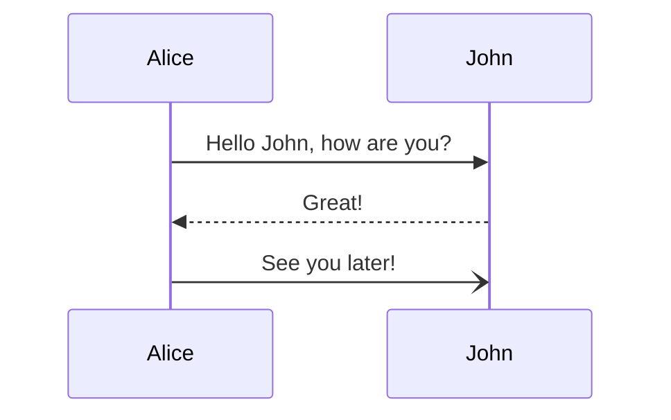

# Mermaid Diagrams

Doctave supports [Mermaid](https://mermaid.js.org/) for rendering diagrams and charts in your documentation. Rendered diagrams will match your chosen color scheme, both in light and dark mode. 

Mermaid JS supports a long list of diagram types, such as:

- Flowcharts
- Sequence Diagrams
- Entity Relationship Diagrams
- Gant Charts
- Pie Charts

You can find a full list from Mermaid's [official documentation](https://mermaid.js.org/intro/).

## Syntax

To render a Mermaid JS diagram, use a regular Markdown [code block](./code.md), and set the language of the block to `mermaid`:

~~~plaintext title="Mermaid diagram syntax"
// [!code word:mermaid:1]

~~~

The above example will get rendered as follows:

## Error handling

<Callout type="warning">
  <Flex gap="1">
    <Icon set="lucide" name="triangle-alert" />

    Doctave doesn't verify your Mermaid JS syntax
  </Flex>
</Callout>

Doctave doesn't check if you have a syntax error in your Mermaid JS diagram. This means even if you have a mistake in your Mermaid syntax, Doctave can't detect these issues and your builds will succeed.

In production, the error won't be shown, and the diagram will be skipped if an error is found while rendering.

Doctave Studio will show an error if you have a mistake in your Mermaid diagram while editing:

